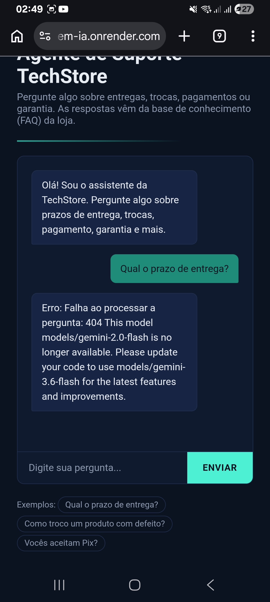
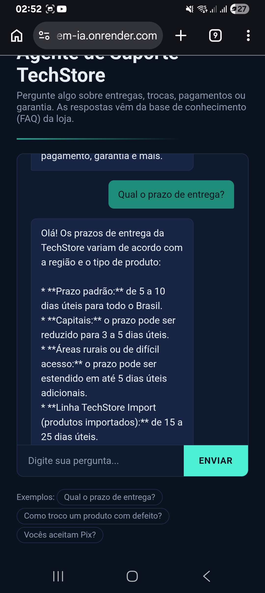

# 🤖 Agente TechStore — Challenge Alura Agente

Agente de inteligência artificial que responde perguntas de clientes com base
em uma FAQ (base de conhecimento) de uma loja de eletrônicos fictícia, a
**TechStore**. O agente utiliza a API do **Google Gemini** com uma abordagem
de **RAG (Retrieval-Augmented Generation)** para garantir que as respostas
sejam sempre baseadas no conteúdo do documento fornecido, e não em
conhecimento genérico do modelo.

---

## 📖 Descrição geral do projeto

O objetivo é oferecer um atendimento automatizado de primeiro nível,
respondendo dúvidas frequentes de clientes (entrega, trocas, garantia,
pagamento etc.) a partir de um arquivo CSV de FAQ. O usuário faz a pergunta
em linguagem natural em uma interface de chat web, e o agente:

1. Busca no documento os trechos mais relevantes para a pergunta.
2. Usa o Gemini para gerar uma resposta natural, fundamentada apenas nesses
   trechos.
3. Se a informação não existir na base, o agente informa isso ao invés de
   inventar uma resposta.

---

## 🏗️ Arquitetura da solução

```
                     ┌─────────────────────────┐
                     │      Interface Web       │
                     │   (templates/index.html) │
                     └────────────┬─────────────┘
                                  │ POST /perguntar
                                  ▼
                     ┌─────────────────────────┐
                     │        app.py            │
                     │   (API Flask / rotas)    │
                     └────────────┬─────────────┘
                                  │
                                  ▼
                     ┌─────────────────────────┐
                     │       agent.py            │
                     │  DocumentAgent (RAG)      │
                     │                            │
                     │  1. Carrega CSV            │
                     │  2. Gera embeddings         │
                     │     (Gemini text-embedding) │
                     │  3. Busca por similaridade   │
                     │     de cosseno               │
                     │  4. Gera resposta            │
                     │     (Gemini generative model)│
                     └────────────┬─────────────┘
                                  │
                                  ▼
                     ┌─────────────────────────┐
                     │  data/faq_techstore.csv  │
                     │   (base de conhecimento)  │
                     └─────────────────────────┘
```

- **Retrieval (recuperação):** cada linha do CSV (pergunta + resposta) é
  transformada em um vetor de embedding com o modelo `text-embedding-004`
  do Gemini. A pergunta do usuário também é transformada em vetor, e os
  trechos mais próximos (similaridade de cosseno) são selecionados como
  contexto.
- **Generation (geração):** o contexto recuperado é injetado em um prompt
  enviado ao modelo generativo (`gemini-2.0-flash`), que produz a resposta
  final em linguagem natural.

---

## 🛠️ Tecnologias e ferramentas utilizadas

| Camada              | Tecnologia                                   |
|---------------------|-----------------------------------------------|
| Linguagem            | Python 3.11                                   |
| Framework web        | Flask                                         |
| LLM / Embeddings     | Google Gemini (`gemini-2.0-flash`, `text-embedding-004`) |
| Processamento de dados | Pandas, NumPy                               |
| Servidor de produção | Gunicorn                                      |
| Containerização      | Docker                                        |
| Deploy               | Oracle Cloud Infrastructure (OCI) — Free Tier |

---

## ▶️ Instruções para executar o projeto

### 1. Pré-requisitos
- Python 3.11+
- Uma chave de API do Google Gemini, gerada gratuitamente em
  [aistudio.google.com/app/apikey](https://aistudio.google.com/app/apikey)

### 2. Clonar o repositório
```bash
git clone https://github.com/SEU_USUARIO/challenge-alura-agente.git
cd challenge-alura-agente
```

### 3. Criar ambiente virtual e instalar dependências
```bash
python3 -m venv venv
source venv/bin/activate   # Windows: venv\Scripts\activate
pip install -r requirements.txt
```

### 4. Configurar variáveis de ambiente
```bash
cp .env.example .env
# edite o arquivo .env e cole sua chave em GEMINI_API_KEY
```

### 5. Rodar a aplicação localmente
```bash
python app.py
```
Acesse **http://localhost:8080** no navegador.

### 6. Rodar com Docker (opcional)
```bash
docker build -t agente-techstore .
docker run -p 8080:8080 --env-file .env agente-techstore
```

---

## ☁️ Deploy na Oracle Cloud Infrastructure (OCI)

Este projeto foi feito para rodar como um container na OCI usando o
**Always Free Tier**. Passo a passo resumido:

1. **Criar uma conta OCI** (nível gratuito) em [cloud.oracle.com](https://cloud.oracle.com).
2. **Compute Instance (VM.Standard.E2.1.Micro, Always Free):**
   - Crie uma instância Ubuntu na sua conta OCI.
   - Abra a porta 8080 na *Security List* da VCN (ou 80/443 se usar proxy).
   - Conecte via SSH e instale o Docker:
     ```bash
     sudo apt update && sudo apt install -y docker.io
     sudo systemctl enable --now docker
     ```
3. **Enviar o projeto para a VM** (via `git clone` do seu repositório ou `scp`).
4. **Configurar o `.env`** na VM com sua `GEMINI_API_KEY`.
5. **Construir e rodar o container:**
   ```bash
   sudo docker build -t agente-techstore .
   sudo docker run -d -p 8080:8080 --env-file .env --restart unless-stopped agente-techstore
   ```
6. **Acessar publicamente** via `http://IP_PUBLICO_DA_VM:8080`.

> Alternativa: usar o serviço **OCI Container Instances**, publicando a
> imagem no **OCI Container Registry (OCIR)** e criando a instância de
> container diretamente pelo console, sem gerenciar uma VM manualmente.

### 🔗 Evidência do deploy
- **Link público:** `https://SUBSTITUA-- **Link público:** [https://challenge-em-ia.onrender.com](https://challenge-em-ia.onrender.com)
- **Prints da aplicação em funcionamento:**








![Aplicação em produção - exemplo 3]
(Screenshot_20260824_025505_Chrome.jpg)

---

## 💬 Exemplos de perguntas que o agente consegue responder

- "Qual é o prazo de entrega dos produtos?"
- "Como faço para trocar um produto com defeito?"
- "Vocês aceitam Pix? Tem desconto?"
- "Os produtos têm garantia?"
- "Posso cancelar meu pedido depois de comprar?"
- "Como funciona o programa de fidelidade?"

## ✅ Exemplos de respostas geradas pelo agente

**Pergunta:** Qual é o prazo de entrega dos produtos?
**Resposta:** O prazo padrão de entrega é de 5 a 10 dias úteis para todo o
Brasil, podendo ser de 3 a 5 dias úteis para capitais. Compras acima de
R$ 300 têm frete grátis.

**Pergunta:** Como faço para trocar um produto com defeito?
**Resposta:** Você tem até 30 dias corridos após o recebimento para
solicitar a troca por defeito de fabricação, através da opção "Solicitar
troca" em "Meus Pedidos". O produto é recolhido gratuitamente em sua
residência.

**Pergunta:** Vocês entregam bicicletas elétricas?
**Resposta:** Não encontrei essa informação na minha base de conhecimento
atual. Recomendo entrar em contato com o suporte pelo chat do site, e-mail
suporte@techstore.com.br ou telefone 0800 123 4567 para mais detalhes.

*(Respostas reais podem variar de acordo com o modelo Gemini utilizado.)*

---

## 📁 Estrutura do repositório

```
challenge-alura-agente/
├── app.py                  # Aplicação Flask (rotas da API e da interface web)
├── agent.py                # Lógica do agente (RAG com Gemini)
├── data/
│   └── faq_techstore.csv   # Base de conhecimento (documento fonte)
├── templates/
│   └── index.html          # Interface de chat
├── requirements.txt        # Dependências Python
├── Dockerfile               # Imagem para deploy (OCI)
├── .env.example              # Modelo de variáveis de ambiente
├── .gitignore
└── README.md
```

---

## 📌 Sobre o Challenge Alura Agente

Projeto desenvolvido como entrega do **Challenge Alura Agente**, cumprindo
os requisitos de: repositório organizado com histórico de commits, agente
funcional baseado em documento (CSV), documentação completa e evidência de
deploy em nuvem (OCI).
